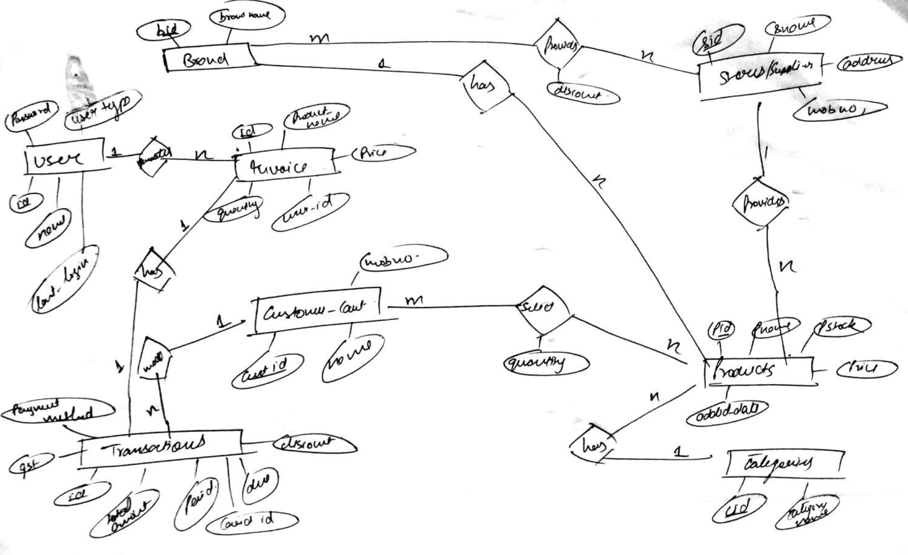
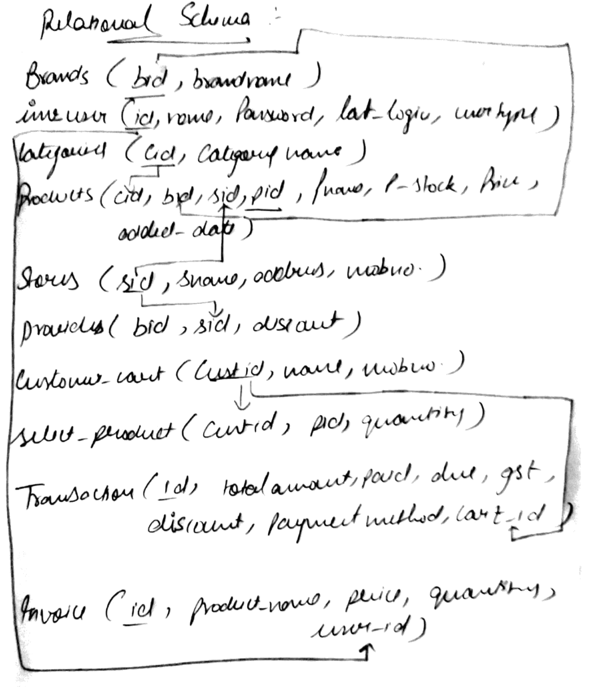

# Salary Management System

## Overview
The Salary Management System is a database project designed to efficiently manage employee information, payroll, leaves, and funds. Built using PL/SQL and Oracle Database, the system also demonstrates distributed database concepts through data fragmentation.

## Features
- Employee details management
- Salary calculation based on leaves and workdays
- Fund and transaction management
- Audit trails for changes in employee salaries and funds
- Distributed database implementation using horizontal fragmentation

## ER Diagram

## Relational Schema

## How to Use
1. **Set up Oracle Database**:
   - Install Oracle Database and SQL*Plus or Oracle SQL Developer.

2. **Create Tables**:
   - Run the scripts in `sql/create_tables.sql`.

3. **Insert Data**:
   - Use `sql/insert_data.sql` to populate tables with sample data.

4. **Add Procedures and Triggers**:
   - Execute `sql/procedures.sql` and `sql/triggers.sql`.

5. **Test the System**:
   - Use the functions and procedures to interact with the database.

6. **(Optional) Distributed Database**:
   - Simulate a distributed setup using the fragmentation queries provided.

## How It Works
### Procedures and Functions
- `PaySalary()`: Automates salary payment.
- `GenerateSalary()`: Calculates salary considering leaves.

### Triggers
- `AddEmpSalary`: Triggers when a new employee salary is assigned.
- `UpdateFund`: Triggers when funds are updated.

## Transparency Levels in Distributed Database
1. **Location Transparency**: Users don't need to know data locations.
2. **Fragmentation Transparency**: Data is divided into logical fragments.
3. **Local Mapping Transparency**: Data retrieval uses mapping information.

## Prerequisites
- Oracle Database installed.
- Basic understanding of SQL and PL/SQL.
